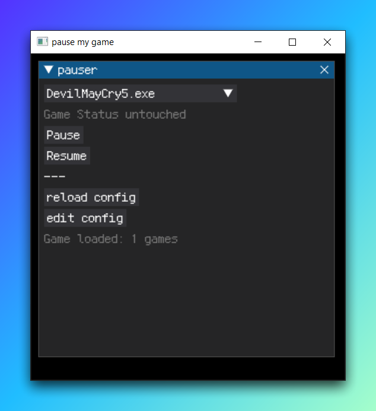

## what is this
this is a simple app for windows to pause and resume a process by its name.

this tool can pause and resume a game process very easily.

## how to use
1. install dependiences
```
pip install dearpygui
```
2. run main.py
```
python main.py
```

## how to know exename?

1. open taskmanager
2. right any process and see properties

## snapshots



## samiliar tool 
https://github.com/Merrit/nyrna/
